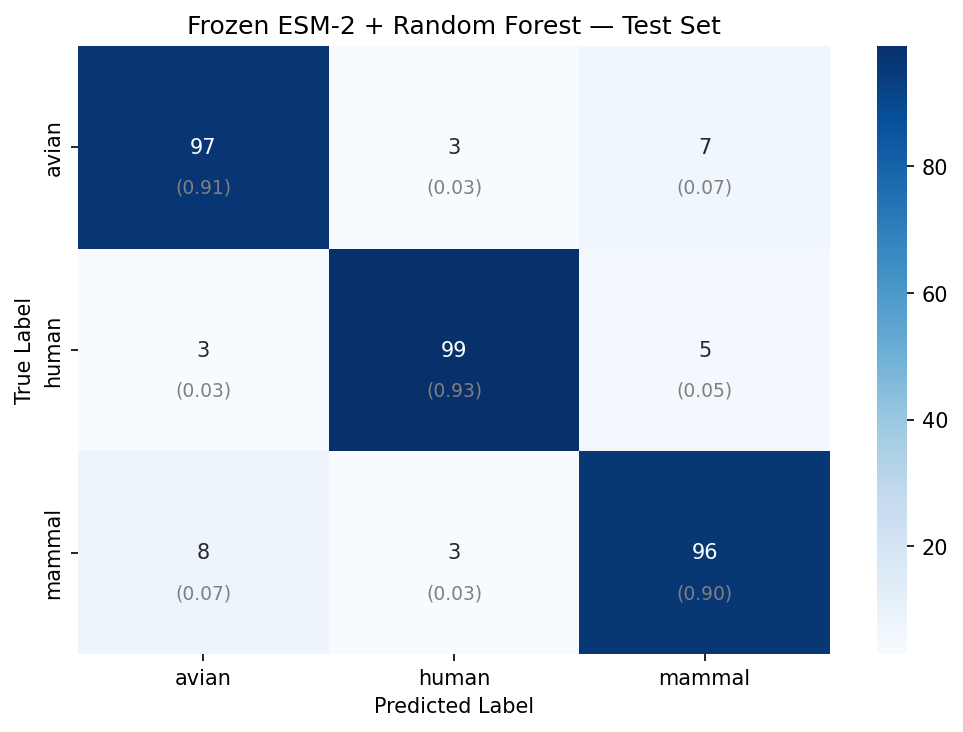

# Predicting Influenza A Host Species from PB2 Sequences with ESM-2

Access the model via huggingface!:
https://huggingface.co/bisqueporcelain/pb2-host-classifier

This project classifies the host of an influenza A virus as human, avian, or other mammal,
using only the amino-acid sequence of its PB2 segment and the ESM-2 protein language
model. A random forest over frozen ESM-2 embeddings reaches 90.97% test accuracy against a
chance baseline of 33.3%.

Fine-tuning the transformer did not improve on this. That negative result is the most
interesting finding of the project, and the sections below analyse it directly.

## Contents

- [Quick start](#quick-start)
- [Demonstration](#demonstration)
- [Requirements](#requirements)
- [Background literature](#background-literature)
- [Dataset](#dataset)
- [Methods](#methods)
- [⚠️ Data disclaimer: read before running](#data-disclaimer)
- [Original results](#original-results)
- [Limitations](#limitations)
- [Next steps](#next-steps)
- [Repository layout](#repository-layout)
- [Running it without GISAID access](#running-it-without-gisaid-access)
- [Reproducing the real results](#reproducing-the-real-results)
- [Process write-up](#process-write-up)
- [References and acknowledgements](#references-and-acknowledgements)

## Quick start

These commands run the full pipeline on generated stand-in data, so they require no GISAID
account:

```bash
git clone https://github.com/bisqueporcelain/pb2-host-classifier.git
cd pb2-host-classifier
python -m venv .venv && source .venv/bin/activate
pip install -r requirements.txt
python scripts/generate_synthetic_data.py
jupyter notebook notebooks/pb2_host_prediction.ipynb
```

Set `USE_SYNTHETIC_DATA = True` in the config cell (cell 4), this runs the notebook top to bottom.

Important information:

- **This repository ships no trained model.** The weights derive from GISAID sequences, so
  `.gitignore` excludes them. The repository therefore contains no checkpoint and no
  standalone inference script. Running the project means running the notebook, which
  trains every model from scratch.

- **Sample-data accuracy tests the code path only.** Read the
  [data disclaimer](#data-disclaimer) before you quote any number the notebook prints.

To reproduce the numbers in this README, see
[Reproducing the real results](#reproducing-the-real-results).

## Demonstration

> **Placeholder. No recording exists yet.** The documentation rubric this README follows
> asks for a visual that shows the system working. To produce one, record a terminal
> session with `asciinema` or `terminalizer` that runs
> `python scripts/generate_synthetic_data.py` and then the notebook's Stage-1 cell, which
> prints per-model test accuracies. A screenshot of one sequence's predicted host with its
> class probabilities would serve the same purpose at lower cost.

The figure below shows a result rather than a demonstration. It is the random-forest
confusion matrix, generated from the real GISAID data.



The random forest classified 90.97% of 321 held-out sequences correctly, using a single
60/20/20 split. The [Limitations](#limitations) section explains why that figure does not
establish a ranking among the models.

## Requirements

| | |
|---|---|
| Python | 3.10 or newer, last run on 3.13 |
| Core libraries | PyTorch ≥ 2.0, `fair-esm` ≥ 2.0, scikit-learn ≥ 1.3, Biopython ≥ 1.81, NumPy, pandas, SciPy |
| Analysis and plotting | umap-learn, matplotlib, seaborn |
| Interface | Jupyter |
| Model checkpoint | `esm2_t33_650M_UR50D`, 650M parameters, roughly 2.5 GB. `fair-esm` downloads it on first use and caches it under `~/.cache/torch/hub/checkpoints/` |
| GPU | Required in practice. Embedding extraction over 1602 sequences is the bottleneck, and fine-tuning the 650M checkpoint needs about 16 GB of VRAM at `batch_size=4` |
| Runtime | Fine-tuning takes tens of minutes to several hours depending on the GPU. The original runs used Colab (T4 and A100) and an HPC node |

Install PyTorch with the CUDA build that matches your driver, following
[pytorch.org/get-started/locally](https://pytorch.org/get-started/locally/), then install
the rest:

```bash
pip install -r requirements.txt
```

Two flags gate the expensive stages, and both default to off. Set
`RUN_ATTENTION_ANALYSIS = True` (cell 24) and `RUN_FINETUNING = True` (cell 34) to enable
them.

## Background literature

PB2 determines host range in influenza A. Mutations at residues 627 and 701 rank among the
best-characterised markers of avian-to-mammalian adaptation. If any single genome segment
carries host signal in its primary sequence, PB2 is that segment.

ESM-2 is a BERT-style masked language model trained on roughly 65M protein sequences
rather than text. It embeds each amino acid as a 1280-dimensional contextual vector. This
project asks a transfer-learning question: how much task-specific adaptation does a
protein language model need to solve a host-prediction task?

## Dataset

| | |
|---|---|
| Source | GISAID EpiFlu |
| Subtype | Influenza A / H5N1, all 1602 sequences |
| Segment | PB2 |
| Sequences | 1602 total: 534 human, 534 avian, 534 mammal, downsampled to balance |
| Typical length | 759 residues |
| Split | Stratified 60 / 20 / 20, giving 960 train, 321 val, 321 test |

The mammal class spans dairy cattle, swine, felids, and marine mammals, which are the H5N1
spillover hosts of the 2024–25 outbreak.

**This repository contains none of the sequences themselves.** GISAID's terms prohibit
redistribution. `data/sample_accessions.csv` documents the expected input format using
synthetic records, and [`data/README.md`](data/README.md) explains how to obtain real data
with your own GISAID access.

## Methods

Three stages, ordered by how much each stage lets the model adapt.

**1. Frozen embeddings with classical classifiers.** Mean-pool ESM-2's final-layer residue
embeddings into one 1280-dimensional vector per sequence, then fit logistic regression,
which tests linear separability, and a random forest, which allows nonlinear splits. No
ESM-2 parameter trains.

**2. Frozen embeddings with an MLP head.** The same vectors feed a learned 1280 to 512 to
3 MLP, trained with dropout, Adam, and best-checkpoint selection on validation accuracy.

**3. End-to-end fine-tuning.** Unfreeze the top transformer blocks, the last 3 of 33 plus
a last-8 variant, replace mean-pooling with learned attention pooling, and add a four-layer
classifier head with batch norm. Attention pooling addresses a specific problem: host
adaptation depends on a few residues, and an average over 759 positions dilutes them.
Training uses AdamW with weight decay 0.01, gradient clipping at 1.0, a cosine-annealed
learning rate, and early stopping.

<a id="data-disclaimer"></a>

## ⚠️ Data disclaimer: read before running

**This repository ships sample data only.** The results below come from real influenza
sequences in the GISAID EpiFlu database, whose access agreement forbids redistribution. No
real sequences, accessions, or strain identifiers appear anywhere in this repository.

What that means in practice:

- **The numbers in "Original results" below came from real GISAID data.** They are the
  actual findings of the project.
- **Running the notebook as shipped will not reproduce them.** It runs on generated sample
  data from `scripts/generate_synthetic_data.py`, which exists to make the pipeline
  executable rather than reproducible.
- **Any accuracy you obtain from sample data confirms only that the code runs end to
  end.** It reflects signal that the generator planted deliberately and says nothing about
  influenza biology. Do not cite it, quote it, or compare it to the table below.
- Every sample identifier carries the `SYNTH` prefix, so the two datasets stay
  distinguishable.

Reproducing the original results requires your own GISAID access. See
[`data/README.md`](data/README.md).

## Original results

These come from the real GISAID dataset: 1602 H5N1 PB2 sequences, 534 per host class,
stratified 60/20/20 split.

| Stage | Model | What trains | Test accuracy |
|---|---|---|---|
| 1 | Frozen ESM-2 + logistic regression | classifier only | 83.80% |
| 1 | **Frozen ESM-2 + random forest** | classifier only | **90.97%** |
| 2 | Frozen ESM-2 + MLP head | 2-layer MLP | 84.11% |
| 3 | Fine-tuned ESM-2 (freeze 30, tune 3) | top 3 layers + head | 89.10% |

Chance accuracy is 33.3% on this balanced three-class problem.

[`results/`](results/) holds the confusion matrices and the full fine-tuning log, both
generated from the real data. Those artifacts are the primary evidence for the numbers
above, because GISAID terms forbid sharing the underlying sequences.

> **Note on the fine-tuned figure.** `results/finetune/confusion_matrix_esm-2_fine-tuned.png`
> sums to 289/321, or 90.03%, which disagrees with the 89.10% in the table. The two come
> from different runs. The table and `training_log_freeze30.txt` report the freeze-30
> configuration, which trains the last 3 layers, while the saved figure comes from a
> freeze-25 run, which trains the last 8. This README reports both rather than reconciling
> them silently. The gap between them, roughly 0.9 points or three test sequences,
> illustrates the run-to-run variance that makes the single-split results below unreliable
> as a ranking.

### Why didn't fine-tuning win?

1. **Too little data.** 960 training sequences must constrain roughly 60M trainable
   parameters, even with 30 of 33 layers frozen. Training accuracy stays flat at about
   0.82 from epoch 2 through epoch 9, then rises to 0.85 train and 0.87 validation in the
   tenth and final epoch. The model underfits, then moves late.
2. **The frozen features may already carry the signal.** If ESM-2's pretrained
   representation of residues 627 and 701 already differs by host, a random forest can
   read that difference straight out of the pooled vector, which leaves fine-tuning little
   to add.
3. **Random forests suit this regime.** At 1602 samples and 1280 features, axis-aligned
   ensembles perform well and gradient-trained deep heads struggle.

### Limitations

These bound how much the numbers above mean.

- **Single split, single seed.** Every result comes from one 60/20/20 split at
  `random_state=42`. On 321 test sequences, the gap between 89.10% and 90.97% amounts to
  about 6 sequences, which falls inside plausible seed variation. **The model ranking is
  not statistically established.**
- **No sequence-identity deduplication.** Influenza sequences from one outbreak are
  near-identical. If similar sequences straddle the train/test boundary, every accuracy
  here is inflated. This is the biggest threat to validity.
- **Truncated sequences retained.** The dataset includes partial submissions down to 32
  residues, and truncation rate may correlate with host.
- **H5N1 only.** These results provide no evidence of generalisation to other subtypes.

### Next steps

1. Run 5-fold stratified cross-validation across seeds and report mean ± standard
   deviation.
2. Cluster at 95% identity with CD-HIT or MMseqs2, then split by cluster rather than by
   sequence.
3. Plot attention-pooling weights against residue position to test whether they land on
   627 and 701.
4. Measure a trivial baseline: how far do positions 627 and 701 alone get you, one-hot
   encoded?
5. Drop sequences shorter than about 700 residues and re-run.

## Repository layout

```
pb2-host-classifier/
├── notebooks/
│   └── pb2_host_prediction.ipynb   # full pipeline, preprocessing → fine-tuning
├── scripts/
│   └── generate_synthetic_data.py  # synthetic stand-in so the pipeline is runnable
├── data/
│   ├── sample_accessions.csv       # synthetic records showing expected format
│   └── README.md                   # data provenance, and how to obtain real data
├── results/                        # generated from the REAL data; the evidence
│   ├── baseline/                   # LR + RF confusion matrices, contact maps, summary
│   └── finetune/                   # fine-tuned + MLP head matrices, training log
└── requirements.txt
```

This repository tracks no model weights, embeddings, or FASTA files. `.gitignore` excludes
them so that GISAID-derived data cannot enter a commit by accident.

## Running it without GISAID access

GISAID terms forbid redistributing the sequences, so this repository ships a generator that
produces a synthetic dataset with the same shape, header format, and class balance:

```bash
pip install -r requirements.txt
python scripts/generate_synthetic_data.py
```

Set `USE_SYNTHETIC_DATA = True` in the notebook's config cell, then run it top to bottom.

**These are not the results in this README.** The generator produces the sequences; nobody
observed them. It plants host signal at the residues that drive real PB2 adaptation,
chiefly 627, the classic E627K avian-to-human marker, and 701, at sub-100% penetrance.
That penetrance keeps the task learnable while preventing a perfect split on any single
residue. Purely random sequences would hold every classifier at chance and make the
pipeline look broken, whereas this generator exercises the full code path. Any accuracy
obtained this way tests the code rather than the biology, and every synthetic header
carries the `SYNTH` prefix, so the two datasets stay distinguishable.

## Reproducing the real results

```bash
pip install -r requirements.txt
```

Obtain the FASTA files from GISAID, following [`data/README.md`](data/README.md). Place the
balanced file at `data/all_pb2_sequences_labeled_balanced.fasta`, leave
`USE_SYNTHETIC_DATA = False`, then run the notebook top to bottom.

Two flags gate the expensive stages. Set `RUN_ATTENTION_ANALYSIS = True` and
`RUN_FINETUNING = True` to enable them. The pipeline requires a GPU: embedding extraction
over 1602 sequences is the bottleneck, and fine-tuning the 650M checkpoint needs about
16 GB of VRAM at `batch_size=4`. The original runs used Colab (T4 and A100) and an HPC
node.

## Process write-up

**Placeholder. No write-up exists yet.** This README covers the product side of the
documentation: what the project does and how to run it. A separate write-up should cover
the process side, including why the project started, which approaches failed, and how the
negative result redirected the work. Link it here once it exists.

## References and acknowledgements

Sequence data comes from the **GISAID EpiFlu** database. We gratefully acknowledge the
originating and submitting laboratories that share sequences through GISAID.

- **ESM-2**: Lin et al., *Evolutionary-scale prediction of atomic-level protein structure
  with a language model*, Science (2023). Model `esm2_t33_650M_UR50D` via
  [facebookresearch/esm](https://github.com/facebookresearch/esm).
- **PyTorch**: model training and fine-tuning.
- **scikit-learn**: logistic regression, random forest, and evaluation metrics.
- **Biopython**: FASTA parsing and sequence handling.
- **UMAP**: pre-training structure check on the frozen embeddings.
